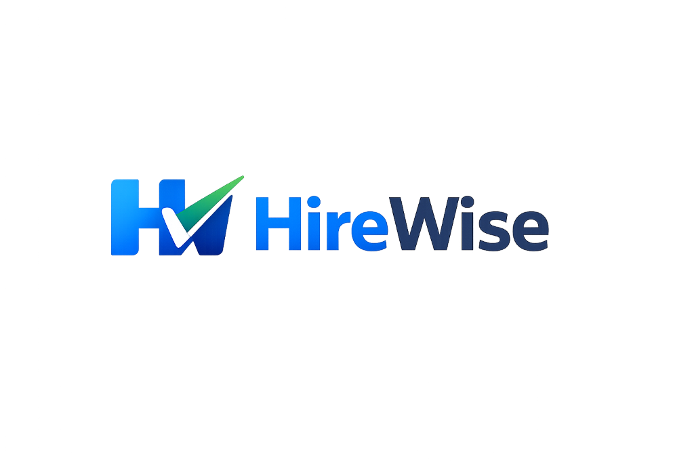
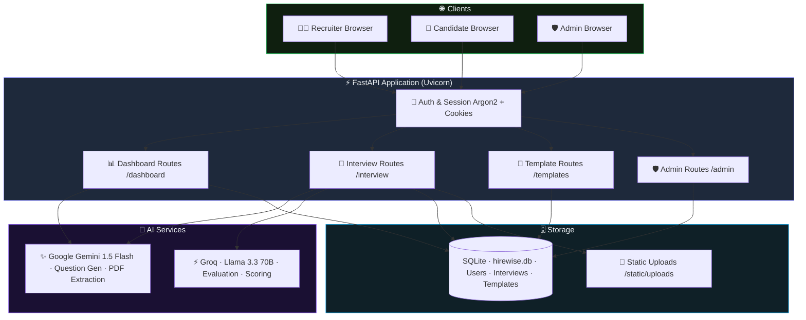

<div align="center">



# HireWise

### AI-Powered Recruitment & Interview Assessment Platform

[](https://python.org)
[](https://fastapi.tiangolo.com)
[](https://sqlite.org)
[](https://groq.com)
[](https://deepmind.google/technologies/gemini/)
[](https://hirewise-81z1.onrender.com)

</div>

---

## 🌐 Live Demo

**[https://hirewise-81z1.onrender.com](https://hirewise-81z1.onrender.com)**


---

## 🚀 What is HireWise?

**HireWise** is a full-stack AI-powered recruitment platform that streamlines the technical interview process from end to end. Recruiters can create intelligent assessments, candidates complete async interviews, and Groq's **Llama 3.3 70B** model provides instant technical scoring and analysis — all without scheduling a single call.

---

## ✨ Key Features

| Feature | Description |
|---|---|
| 🤖 **AI Question Generation** | Auto-generate role-specific interview questions using Google Gemini 1.5 Flash |
| 📊 **AI Technical Analysis** | Groq Llama 3.3 70B evaluates responses, scores 0-100, and highlights strengths & weaknesses |
| 💾 **Question Templates** | Save, reuse, and manage sets of interview questions across multiple assessments |
| 📋 **Async Interview Flow** | Candidates complete interviews at their own pace — no live scheduling needed |
| 🎯 **Recruiter Dashboard** | LinkedIn-inspired recruiter hub to manage, review, and decide on assessments |
| 🛡️ **Admin Panel** | Full control panel to view all users, interview results, reset passwords, and delete accounts |
| 📄 **PDF Upload** | Upload assessment PDFs — questions are auto-extracted via Gemini AI |
| 🔐 **Secure Auth** | Argon2-hashed passwords, cookie-based session management |

---

## 🏗️ System Architecture



### 📁 Project Structure


```
HireWise/
├── app/
│   ├── main.py              # All FastAPI routes & business logic
│   ├── models.py            # SQLAlchemy ORM models (User, Interview, QuestionTemplate)
│   ├── database.py          # DB engine, session factory
│   ├── templates/
│   │   ├── login.html
│   │   ├── signup.html
│   │   ├── dashboard.html
│   │   ├── interview.html
│   │   └── admin.html
│   └── static/
│       ├── img/
│       ├── style.css
│       └── uploads/
├── .env
├── hirewise.db
├── requirements.txt
└── README.md
```

## 🧠 AI Stack

```
Question Generation  ──►  Google Gemini 1.5 Flash
Technical Evaluation ──►  Groq  ·  Llama 3.3 70B (Versatile)
PDF Extraction       ──►  Google Gemini 1.5 Flash + pypdf
```

The evaluation pipeline uses Groq's native `json_object` response mode for reliable, schema-consistent scoring — no regex parsing required.

---

## 👤 User Roles

### 🎯 Recruiter
- Create interview assessments (AI-generated or manual questions)
- Upload PDF assessments for auto-extraction
- View candidate Q&A logs and AI analysis reports
- Pass / Fail candidates with written feedback
- Save reusable question templates

### 🧑‍💻 Candidate
- Receive interview assignments via email
- Complete interviews asynchronously at any time
- Get AI-powered evaluation upon submission

### 🛡️ Admin
- View all candidates and recruiters in one panel
- See every interview's pass/fail status and AI score
- Reset any user's password
- Delete users and their associated data

---

## ⚡ Getting Started

### Prerequisites
- Python 3.11+
- A [Google AI Studio](https://aistudio.google.com/) API key (Gemini)
- A [Groq Cloud](https://console.groq.com/) API key

### 1. Clone & install

```bash
git clone https://github.com/your-username/HireWise.git
cd HireWise
python3 -m venv venv
source venv/bin/activate
pip install -r requirements.txt
```

### 2. Configure environment

Create a `.env` file in the project root:

```env
GEMINI_API_KEY=your_gemini_api_key_here
GROQ_API_KEY=your_groq_api_key_here
```

### 3. Run the application

```bash
./venv/bin/python3 -m uvicorn app.main:app --reload --port 8000 --host 0.0.0.0
```

Open **http://localhost:8000** in your browser.

---

## 🔑 Default Routes

| Route | Access | Description |
|---|---|---|
| `/` | Public | Landing / Login page |
| `/signup` | Public | Register as recruiter or candidate |
| `/dashboard` | Authenticated | Role-based dashboard |
| `/interview/{id}` | Candidate | Complete an interview |
| `/admin` | Admin only | Full admin control panel |

### Create an Admin Account

```bash
curl -X POST http://localhost:8000/admin/create \
  -F "full_name=Admin" \
  -F "email=admin@yourcompany.com" \
  -F "password=yourpassword"
```

Then log in at `/login` and navigate to `/admin`.

---

## 🔄 Interview Flow

```
Recruiter creates assessment
        │
        ▼
  AI generates questions  ──or──  Manual / PDF questions
        │
        ▼
  Candidate receives & completes interview
        │
        ▼
  Groq AI evaluates transcript → Score (0-100) + Strengths + Weaknesses
        │
        ▼
  Recruiter reviews AI report → Pass / Fail decision
```

---

## 🛠️ Tech Stack

| Layer | Technology |
|---|---|
| **Web Framework** | FastAPI (Python) |
| **Templating** | Jinja2 |
| **Database** | SQLite + SQLAlchemy |
| **Auth** | Passlib (Argon2) + Cookie sessions |
| **AI — Evaluation** | Groq Cloud (Llama 3.3 70B Versatile) |
| **AI — Generation** | Google Gemini 1.5 Flash |
| **PDF Parsing** | pypdf + Gemini extraction |
| **Server** | Uvicorn |

---

## 📦 Requirements

```
fastapi
uvicorn
sqlalchemy
passlib[argon2]
python-multipart
jinja2
python-dotenv
google-generativeai
groq
pypdf
```

---

## 🔒 Security Notes

> ⚠️ **This is a prototype / MVP.** Before deploying to production:
> - Replace cookie-based sessions with JWT or OAuth2
> - Add HTTPS (use a reverse proxy like Nginx + Let's Encrypt)
> - Restrict `/admin/create` route after initial setup
> - Never commit `.env` to version control — add it to `.gitignore`

---

## 📜 License

MIT License © 2026 HireWise

---

<div align="center">
Built with ❤️ using FastAPI, Groq, and Google Gemini
</div>
